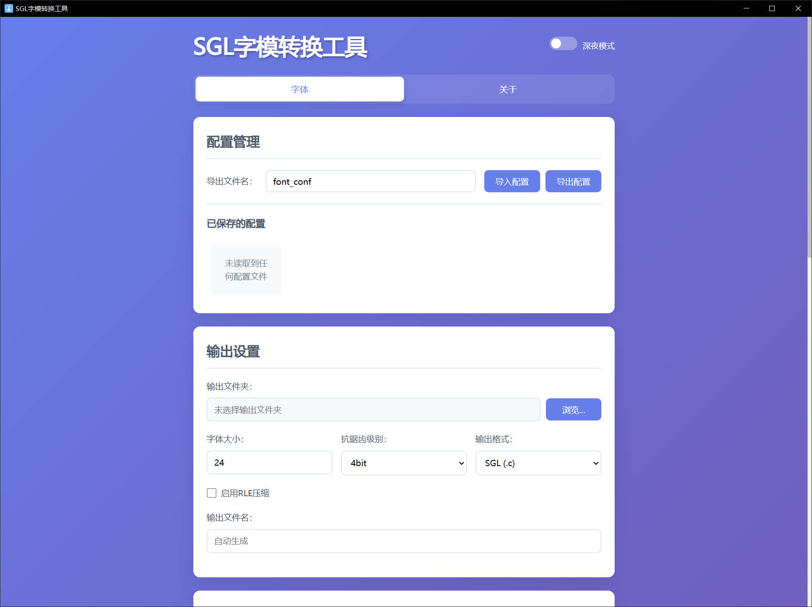
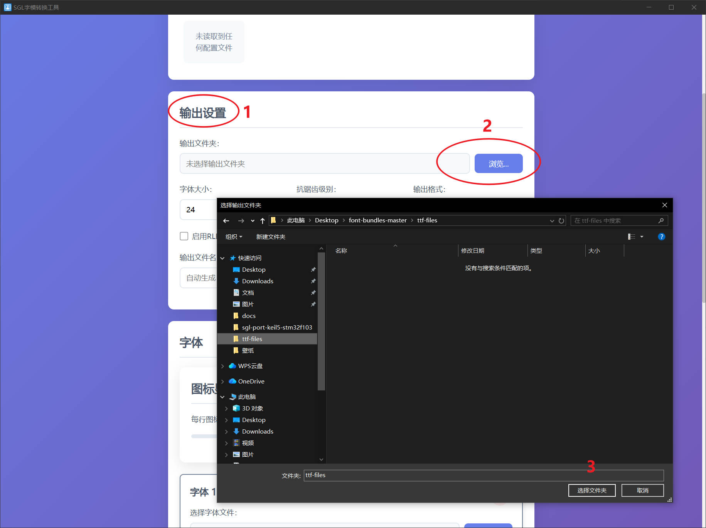
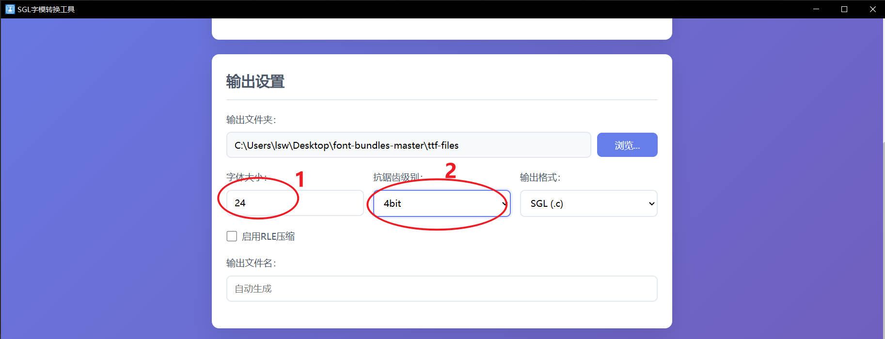
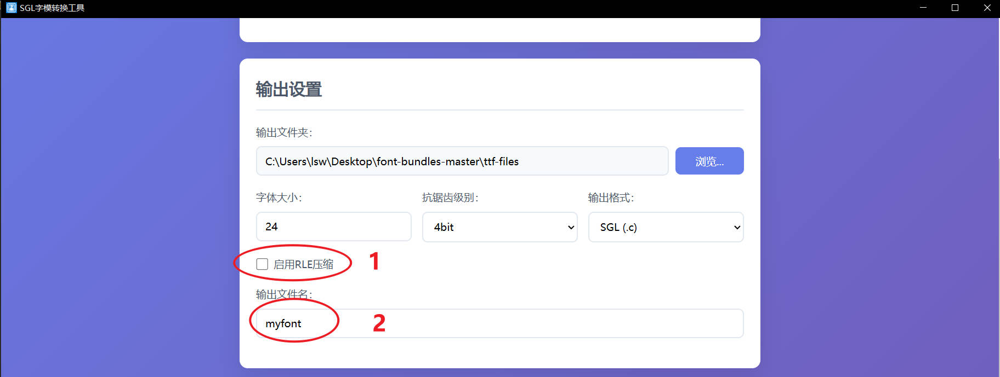
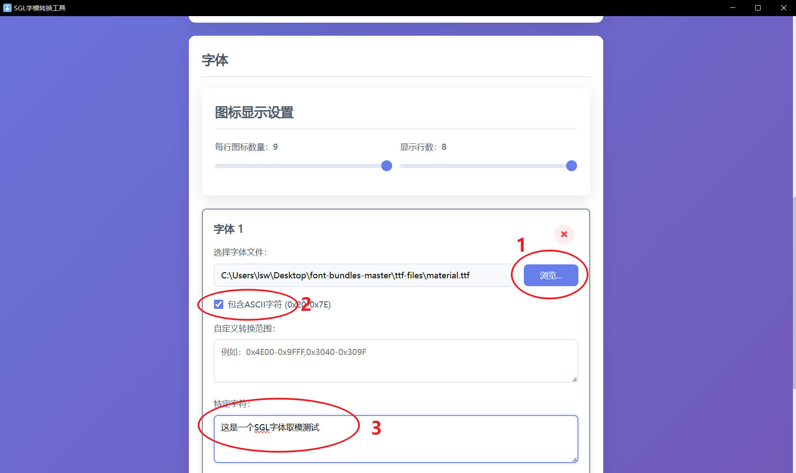
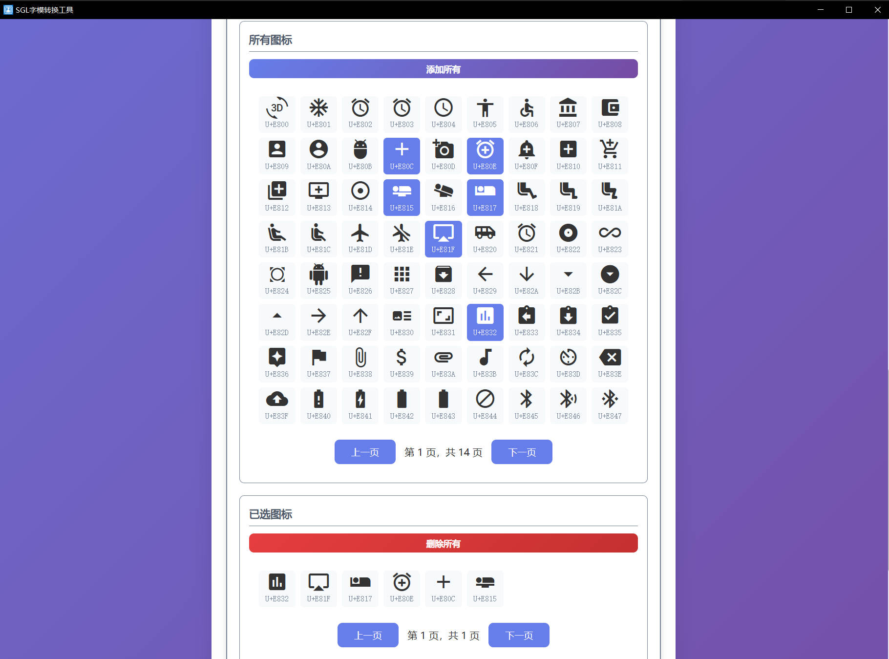
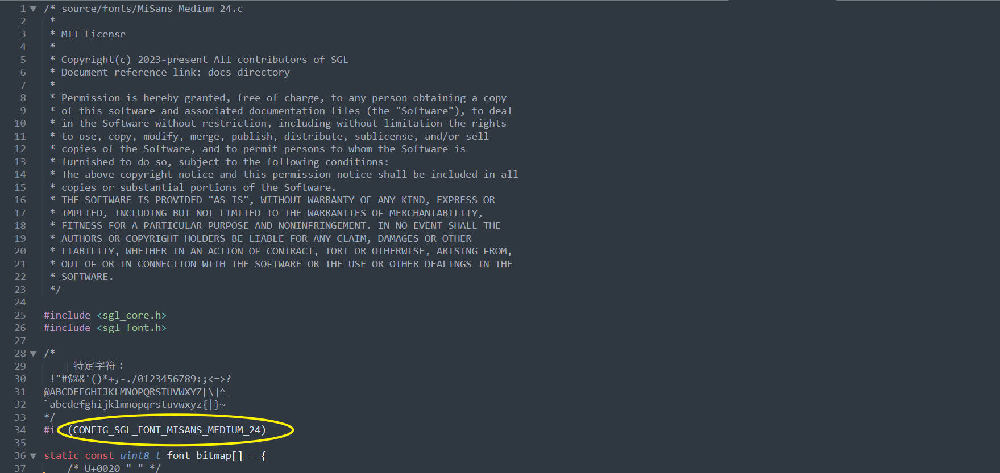
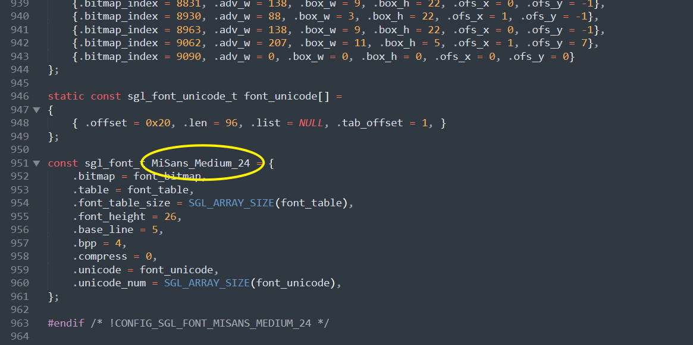
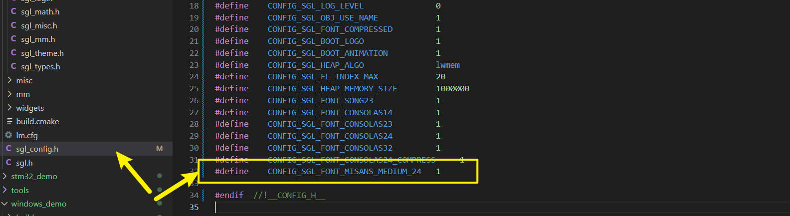

## 字体生成
字体取模请使用SGL的字体生成工具，SGL只支持自己的字体格式，工具请在QQ544602724群文件中下载【SGL字体取模-测试版-1221-1746.rar】，生成步骤如下：   
1. 打开字体生成工具     
2. 点击【SGL字模转换工具.exe】进入工具界面，界面如下：    
   
3. 滚动到【输出配置】，找到输出文件夹，然后点击【浏览】按键，选择一个空文件夹，作为字体输出文件夹     
        
4. 选择字体大小，抗锯齿级别(目前只支持2和4)    
        
5. 选择是否启动压缩，并填写输出文件名    
        

6. 滚动到【字体】栏，并且点击【浏览】按键，选择字体文件，然后是否勾选“包含ASCII字符”，在特殊字符中填写你需要的中文    
         
7. (可选)如果需要生成图标字体，则滚动到【所有图标】栏，此时会列举出这个字体中的所有图标，如果你想生成图标，只需要选中你需要的图标即可   
        
8. 滚动到最后，点击【开始转换】，即可生成.c字体文件，生成的字体在刚才选择的输出文件夹中    

### 字体使用
例如我生成的字体文件名为font.c，这个文件的内容如下：    
    
            
将生成的字体文件复制到SGL中，然后打开sgl_config.h文件，新定义一个CONFIG_SGL_FONT_MISANS_MEDIUM_24宏定义，并设置为1    
   
在你的项目中，使用如下来设置字体：   
```c
sgl_obj_t *label = sgl_label_create(NULL);
sgl_obj_set_pos(label, 100, 200);
sgl_obj_set_size(label, 240, 240);
sgl_label_set_font(label, &MiSans_Medium_24);
sgl_label_set_text(label, "test font");
```
