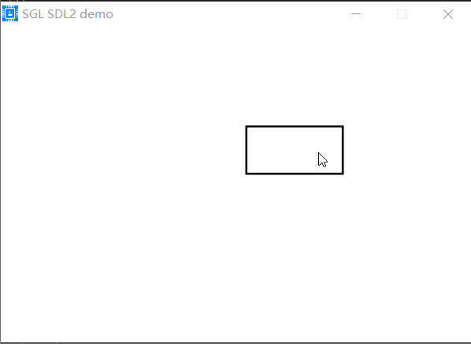
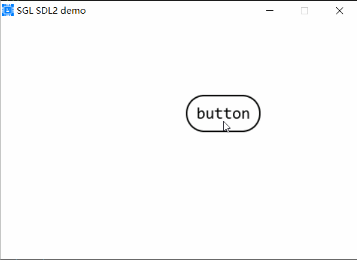
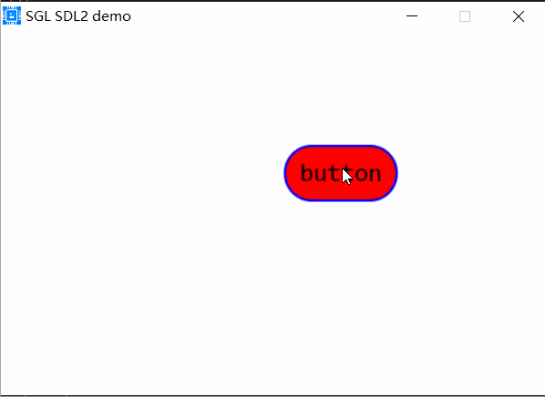
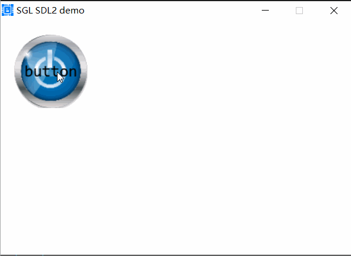

## Button控件
创建一个Button控件，使用如下代码：
```c
sgl_obj_t *button = sgl_button_create(NULL);
sgl_obj_set_pos(button, 250, 100);
sgl_obj_set_size(button, 100, 50);
```
上面代码在默认的活动页面上创建了一个大小为100x50的Button控件，并设置其位置为250,100，效果如下：     
       

### 设置Button的文本
使用sgl_button_set_text()函数设置Button的文本，如下：
```c
sgl_obj_t *button = sgl_button_create(NULL);
sgl_obj_set_pos(button, 250, 100);
sgl_obj_set_size(button, 100, 50);
sgl_button_set_font(button, &consolas24);
sgl_button_set_text(button, "button");
```
```{danger}
所有带有文本的控件，必须设置字体，否则系统会ASSERT，上面的sgl_button_set_font()函数就是设置Button的字体。
```
效果如下：        
           

### 设置Button圆角
使用sgl_button_set_radius()函数设置Button的圆角，如下：    
```c
sgl_obj_t *button = sgl_button_create(NULL);
sgl_obj_set_pos(button, 250, 100);
sgl_obj_set_size(button, 100, 50);
sgl_button_set_font(button, &consolas24);
sgl_button_set_text(button, "button");
sgl_button_set_radius(button, 25);
```
上面的代码中，sgl_button_set_radius()函数设置Button的圆角为25，效果如下：           
             

### 设置Button颜色
使用sgl_button_set_color()函数设置Button的背景颜色，如下：
```c
sgl_obj_t *button = sgl_button_create(NULL);
sgl_obj_set_pos(button, 250, 100);
sgl_obj_set_size(button, 100, 50);
sgl_button_set_font(button, &consolas24);
sgl_button_set_text(button, "button");
sgl_button_set_radius(button, 25);
sgl_button_set_color(button, SGL_COLOR_RED);
```
上面的代码中，sgl_button_set_color()函数设置Button的背景颜色为红色，效果如下：           
            

### 设置Button边框大小和颜色
使用sgl_button_set_border_color()函数设置Button的边框颜色，使用sgl_button_set_border_width()函数设置Button的边框大小，如下：
```c
sgl_obj_t *button = sgl_button_create(NULL);
sgl_obj_set_pos(button, 250, 100);
sgl_obj_set_size(button, 100, 50);
sgl_button_set_font(button, &consolas24);
sgl_button_set_text(button, "button");
sgl_button_set_radius(button, 25);
sgl_button_set_color(button, SGL_COLOR_RED);
sgl_button_set_border_color(button, SGL_COLOR_BLUE);
sgl_button_set_border_width(button, 2);
```
```{tip}
sgl的默认主题中，控件的边框大小是2，颜色是黑色，如果你想设置无边框，可以使用如下方法：
方法1：使用sgl_button_set_border_width(button, 0);设置边框为0
方法2：在source/include/sgl_theme.h文件中将SGL_THEME_BORDER_WIDTH定义为0
```
上面的代码中，sgl_button_set_border_color()函数设置Button的边框颜色为蓝色，sgl_button_set_border_width()函数设置Button的边框大小为2，效果如下：          
         

### 添加Button点击事件
使用sgl_obj_set_event_cb函数来设置Button的事件处理函数，如下：

```c
void button_event_cb(sgl_event_t *event)
{
    switch(event->type)
    {
    case SGL_EVENT_PRESSED:
        SGL_LOG_INFO("button_event_cb: SGL_EVENT_PRESSED\n");
        break;
    case SGL_EVENT_RELEASED:
        SGL_LOG_INFO("button_event_cb: SGL_EVENT_RELEASED\n");
        break;
    }
}
...
sgl_obj_t *button = sgl_button_create(NULL);
sgl_obj_set_pos(button, 250, 100);
sgl_obj_set_size(button, 100, 50);
sgl_button_set_font(button, &consolas24);
sgl_button_set_text(button, "button");
sgl_button_set_radius(button, 25);
sgl_button_set_color(button, SGL_COLOR_RED);
sgl_button_set_border_color(button, SGL_COLOR_BLUE);
sgl_button_set_border_width(button, 2);
sgl_obj_set_event_cb(button, button_event_cb, 0);
```
上面的代码中，sgl_obj_set_event_cb()函数设置Button的事件处理函数为button_event_cb()。              

### 设置Button背景图片
使用sgl_button_set_pixmap来设置Button的背景图片，如下：         
```c
/* 使用图片取模工具生成图片的像素数据 */
extern const sgl_pixmap_t pic1_pixmap;

sgl_obj_t *button = sgl_button_create(NULL);
sgl_obj_set_pos(button, 250, 100);
sgl_obj_set_size(button, 100, 50);
sgl_button_set_font(button, &consolas24);
sgl_button_set_text(button, "button");
sgl_button_set_radius(button, 25);
sgl_button_set_color(button, SGL_COLOR_RED);
sgl_button_set_border_color(button, SGL_COLOR_BLUE);
sgl_button_set_border_width(button, 2);
sgl_obj_set_event_cb(button, button_event_cb, 0);
sgl_button_set_pixmap(button, &pic1_pixmap);
```
上面的代码中，sgl_button_set_pixmap()函数设置Button的背景图片为pic1_pixmap，pic1_pixmap是一个图片像素数据，可以使用图片取模工具生，效果如下：                
           
