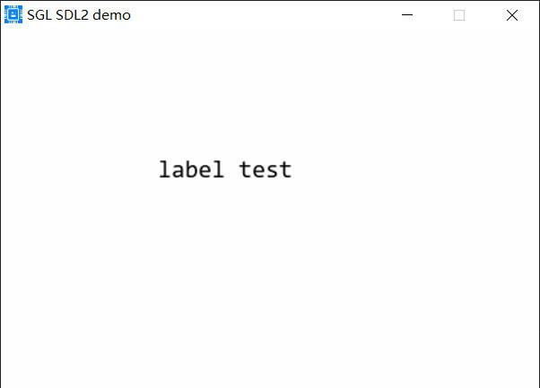
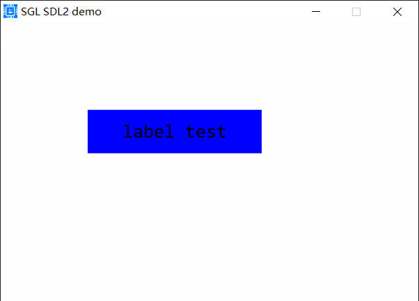

## Label控件
### 创建基本Label控件
下面是一个创建Label控件的例子：
```c
sgl_obj_t *label = sgl_label_create(NULL);
sgl_obj_set_pos(label, 100, 100);
sgl_obj_set_size(label, 200, 50);
sgl_label_set_font(label, &consolas24);
sgl_label_set_text(label, "label test");
```
效果如下：      


### 设置Label的背景颜色
使用sgl_label_set_bg_color函数设置Label的背景颜色，如下：
```c
sgl_obj_t *label = sgl_label_create(NULL);
sgl_obj_set_pos(label, 100, 100);
sgl_obj_set_size(label, 200, 50);
sgl_label_set_font(label, &consolas24);
sgl_label_set_text(label, "label test");
sgl_label_set_bg_color(label, SGL_COLOR_BLUE);
```
效果如下：    
      

### 设置Label的圆角
使用sgl_label_set_radius函数设置Label的圆角，如下：
```c
sgl_obj_t *label = sgl_label_create(NULL);
sgl_obj_set_pos(label, 100, 100);
sgl_obj_set_size(label, 200, 50);
sgl_label_set_font(label, &consolas24);
sgl_label_set_text(label, "label test");
sgl_label_set_bg_color(label, SGL_COLOR_BLUE);
sgl_label_set_radius(label, 10);
```
效果如下：    
     

### 设置Label点击事件
使用sgl_obj_set_event_cb函数来设置Label的事件处理函数，和button一样，请参考button控件的文档

