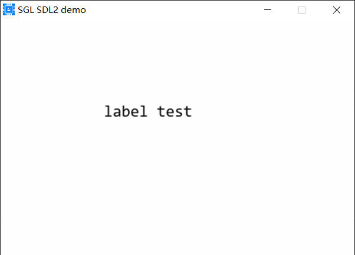
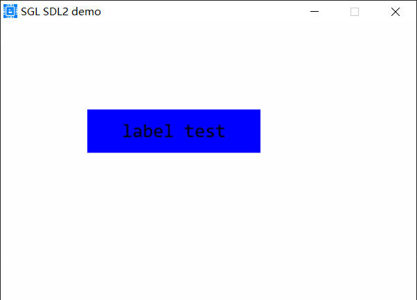

## label控件
创建一个label控件，使用如下代码：
```c
sgl_obj_t *label = sgl_label_create(NULL);
sgl_obj_set_pos(label, 250, 100);
sgl_obj_set_size(label, 100, 50);
```
上面代码在默认的活动页面上创建了一个大小为100x50的Label控件，并设置其位置为250,100，效果如下：     
       

### 设置Label的文本
使用sgl_label_set_text()函数设置Label的文本，如下：
```c
sgl_obj_t *label = sgl_label_create(NULL);
sgl_obj_set_pos(label, 250, 100);
sgl_obj_set_size(label, 100, 50);
sgl_label_set_font(label, &consolas24);
sgl_label_set_text(label, "label");
```
```{danger}
所有带有文本的控件，必须设置字体，否则系统会ASSERT，上面的sgl_label_set_font()函数就是设置Label的字体。
```
效果如下：        
           

### 设置Label背景颜色
使用sgl_label_set_bg_color()函数设置Label的背景颜色，如下：
```c
sgl_obj_t *label = sgl_label_create(NULL);
sgl_obj_set_pos(label, 250, 100);
sgl_obj_set_size(label, 100, 50);
sgl_label_set_font(label, &consolas24);
sgl_label_set_text(label, "label");
sgl_label_set_bg_color(label, SGL_COLOR_RED);
```
上面的代码中，sgl_label_set_bg_color()函数设置Label的背景颜色为红色，效果如下：           


### 设置Label圆角
使用sgl_label_set_radius()函数设置Label的圆角，如下：    
```c
sgl_obj_t *label = sgl_label_create(NULL);
sgl_obj_set_pos(label, 250, 100);
sgl_obj_set_size(label, 100, 50);
sgl_label_set_font(label, &consolas24);
sgl_label_set_text(label, "label");
sgl_label_set_bg_color(label, SGL_COLOR_RED);
sgl_label_set_radius(label, 25);
```
上面的代码中，sgl_label_set_radius()函数设置Label的圆角为25，效果如下：           


### 设置Label文本颜色
使用sgl_label_set_text_color()函数设置Label的文本颜色，如下：
```c
sgl_obj_t *label = sgl_label_create(NULL);
sgl_obj_set_pos(label, 250, 100);
sgl_obj_set_size(label, 100, 50);
sgl_label_set_font(label, &consolas24);
sgl_label_set_text(label, "label");
sgl_label_set_bg_color(label, SGL_COLOR_RED);
sgl_label_set_radius(label, 25);
sgl_label_set_text_color(label, SGL_COLOR_WHITE);
```
上面的代码中，sgl_label_set_text_color()函数设置Label的文本颜色为白色，效果如下：           


### 设置Label透明度
使用sgl_label_set_alpha()函数设置Label的透明度，如下：
```c
sgl_obj_t *label = sgl_label_create(NULL);
sgl_obj_set_pos(label, 250, 100);
sgl_obj_set_size(label, 100, 50);
sgl_label_set_font(label, &consolas24);
sgl_label_set_text(label, "label");
sgl_label_set_bg_color(label, SGL_COLOR_RED);
sgl_label_set_radius(label, 25);
sgl_label_set_text_color(label, SGL_COLOR_WHITE);
sgl_label_set_alpha(label, 128);
```
上面的代码中，sgl_label_set_alpha()函数设置Label的透明度为128（范围0-255），效果如下：           


### 设置Label文本对齐方式
使用sgl_label_set_text_align()函数设置Label的文本对齐方式，如下：
```c
sgl_obj_t *label = sgl_label_create(NULL);
sgl_obj_set_pos(label, 250, 100);
sgl_obj_set_size(label, 200, 100);
sgl_label_set_font(label, &consolas24);
sgl_label_set_text(label, "label");
sgl_label_set_bg_color(label, SGL_COLOR_RED);
sgl_label_set_radius(label, 25);
sgl_label_set_text_color(label, SGL_COLOR_WHITE);
sgl_label_set_text_align(label, SGL_ALIGN_CENTER);
```
上面的代码中，sgl_label_set_text_align()函数设置Label的文本对齐方式为居中，SGL支持以下对齐方式：
- SGL_ALIGN_LEFT：左对齐
- SGL_ALIGN_CENTER：居中对齐
- SGL_ALIGN_RIGHT：右对齐

### 设置Label文本偏移
使用sgl_label_set_text_offset()函数设置Label的文本偏移，如下：
```c
sgl_obj_t *label = sgl_label_create(NULL);
sgl_obj_set_pos(label, 250, 100);
sgl_obj_set_size(label, 100, 50);
sgl_label_set_font(label, &consolas24);
sgl_label_set_text(label, "label");
sgl_label_set_bg_color(label, SGL_COLOR_RED);
sgl_label_set_radius(label, 25);
sgl_label_set_text_color(label, SGL_COLOR_WHITE);
sgl_label_set_text_offset(label, 10, 10);
```
上面的代码中，sgl_label_set_text_offset()函数设置Label的文本偏移为(10, 10)，效果如下：           


### 设置Label文本旋转
使用sgl_label_set_text_rotation()函数设置Label的文本旋转角度，如下：
```c
sgl_obj_t *label = sgl_label_create(NULL);
sgl_obj_set_pos(label, 250, 100);
sgl_obj_set_size(label, 100, 50);
sgl_label_set_font(label, &consolas24);
sgl_label_set_text(label, "label");
sgl_label_set_bg_color(label, SGL_COLOR_RED);
sgl_label_set_radius(label, 25);
sgl_label_set_text_color(label, SGL_COLOR_WHITE);
sgl_label_set_text_rotation(label, 45);
```
```{tip}
文本旋转功能需要在sgl_cfgfix.h中开启CONFIG_SGL_LABEL_ROTATION配置项。
```
上面的代码中，sgl_label_set_text_rotation()函数设置Label的文本旋转角度为45度，效果如下：           


### 使用格式化文本
使用sgl_label_set_text_fmt()函数设置Label的格式化文本，如下：
```c
sgl_obj_t *label = sgl_label_create(NULL);
sgl_obj_set_pos(label, 250, 100);
sgl_obj_set_size(label, 200, 50);
sgl_label_set_font(label, &consolas24);
sgl_label_set_bg_color(label, SGL_COLOR_RED);
sgl_label_set_radius(label, 25);
sgl_label_set_text_color(label, SGL_COLOR_WHITE);

char buf[32];
sgl_label_set_text_buffer(label, buf, sizeof(buf));
sgl_label_set_text_fmt(label, "Value: %d", 100);
```
上面的代码中，sgl_label_set_text_buffer()函数设置Label的文本缓冲区，sgl_label_set_text_fmt()函数设置Label的格式化文本。

### 使用动态格式化文本
使用sgl_label_set_text_fmt_dynamic()函数设置Label的动态格式化文本，如下：
```c
sgl_obj_t *label = sgl_label_create(NULL);
sgl_obj_set_pos(label, 250, 100);
sgl_obj_set_size(label, 200, 50);
sgl_label_set_font(label, &consolas24);
sgl_label_set_bg_color(label, SGL_COLOR_RED);
sgl_label_set_radius(label, 25);
sgl_label_set_text_color(label, SGL_COLOR_WHITE);

sgl_label_set_text_fmt_dynamic(label, "Value: %d.%02d", 10, 50);
```
上面的代码中，sgl_label_set_text_fmt_dynamic()函数会自动分配内存来存储格式化文本。

### 获取Label文本
使用sgl_label_get_text()函数获取Label的当前文本，如下：
```c
sgl_obj_t *label = sgl_label_create(NULL);
sgl_label_set_text(label, "Hello");
char *text = sgl_label_get_text(label);
SGL_LOG_INFO("label text: %s\n", text);
```

### 更新Label文本区域
当直接修改文本缓冲区内容后，需要使用sgl_label_update_text()函数更新Label的文本区域，如下：
```c
sgl_obj_t *label = sgl_label_create(NULL);
char buf[32];
sgl_label_set_text_buffer(label, buf, sizeof(buf));
sgl_label_set_text(label, "Hello");

/* 直接修改文本缓冲区 */
buf[0] = 'W';
buf[1] = 'o';
buf[2] = 'r';
buf[3] = 'l';
buf[4] = 'd';
buf[5] = '\0';

/* 更新文本区域 */
sgl_label_update_text(label);
```
