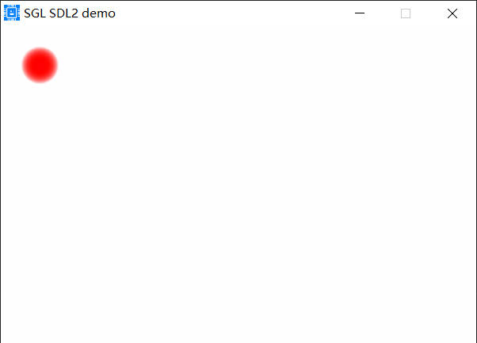

## led控件
led控件用于显示LED灯，使用如下代码：
```c
sgl_obj_t *led = sgl_led_create(NULL);
sgl_obj_set_pos(led, 20, 20);
sgl_obj_set_size(led, 40, 40);
sgl_led_set_on_color(led, SGL_COLOR_RED);
sgl_led_set_off_color(led, SGL_COLOR_GRAY);
sgl_led_set_bg_color(led, SGL_COLOR_WHITE);
sgl_led_set_status(led, true);
```
上面的代码中，sgl_led_set_on_color()函数设置LED灯亮时的颜色，sgl_led_set_off_color()函数设置LED灯灭时的颜色，sgl_led_set_bg_color()函数设置LED灯的背景颜色，sgl_led_set_status()函数设置LED灯的状态，true表示灯亮，false表示灯灭，效果如下：           
         
```{note}
你也可以使用sgl_led_on或者sgl_led_off函数来控制LED灯的亮灭。
```
