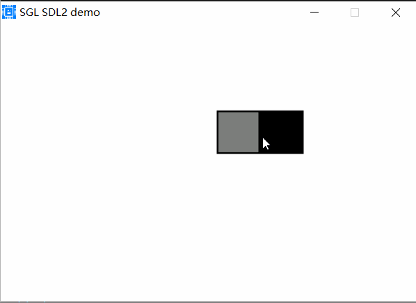
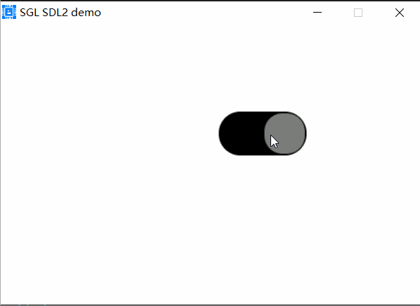

## Switch控件
### 创建Switch控件
创建一个Button控件，使用如下代码：
```c
sgl_obj_t *sw = sgl_switch_create(NULL);
sgl_obj_set_pos(sw, 250, 100);
sgl_obj_set_size(sw, 100, 50);
```
上面代码在默认的活动页面上创建了一个大小为100x50的Switch控件，并设置其位置为250,100，效果如下：         
           

### 设置Switch的圆角半径
使用sgl_switch_set_radius()函数设置Switch的圆角半径，如下： 
```c
sgl_obj_t *sw = sgl_switch_create(NULL);
sgl_obj_set_pos(sw, 250, 100);
sgl_obj_set_size(sw, 100, 50);
sgl_switch_set_radius(sw, 25);
```
上面代码中，sgl_switch_set_radius()函数设置Switch的圆角半径为25，效果如下：          
            

### 添加Switch点击事件
使用sgl_obj_set_event_cb函数来设置Switch的事件处理函数，和button一样，请参考button控件的文档

### 设置Switch的颜色
使用sgl_switch_set_color()函数设置Switch的颜色，颜色为Swicth打开状态的颜色

### 设置Switch的背景颜色
使用sgl_switch_set_bg_color()函数设置Switch的背景颜色，背景颜色为Swicth关闭状态的颜色

### 设置Switch的滑块颜色
使用sgl_switch_set_knob_color()函数设置Switch的滑块颜色

### 设置Switch的边框宽度和颜色
使用sgl_switch_set_border_width()函数设置Switch的边框宽，使用sgl_switch_set_border_color()函数设置Switch的边框颜色

### 设置Switch的状态
使用sgl_switch_set_status()函数设置Switch的状态，true表示打开，false表示关闭

### 获取Switch的状态
使用sgl_switch_get_status()函数获取Switch的状态，true表示打开，false表示关闭
