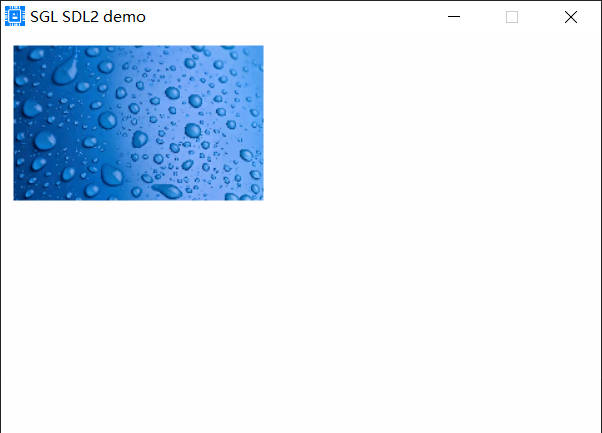
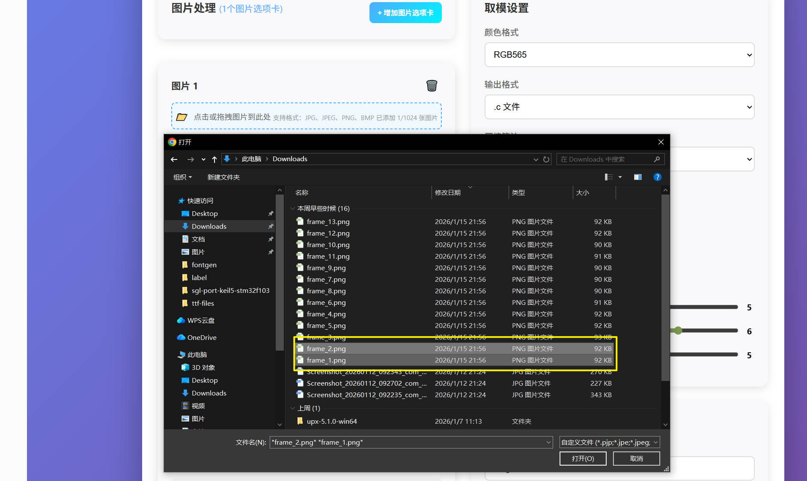
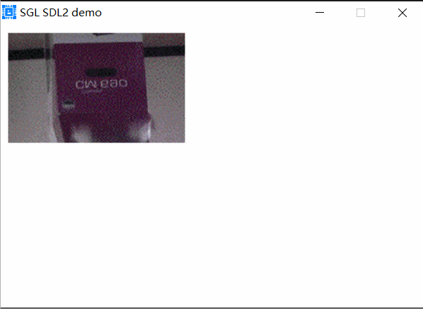

## ext_img控件
### 创建基本ext_img控件
ext_img控件用于显示扩展的图片，该控件支持压缩和非压缩，格式支持RGB332, RGB565, RGB888，使用如下代码：
```c
/* 取模图片数据 */
extern const sgl_pixmap_t pic1_pixmap;

sgl_obj_t *ext_img = sgl_ext_img_create(NULL);
sgl_obj_set_pos(ext_img, 10, 10);
sgl_obj_set_size(ext_img, 200, 124);
sgl_ext_img_set_pixmap(ext_img, &pic1_pixmap);
```
上面的代码中，sgl_ext_img_set_pixmap()函数设置扩展图片的像素数据，pic1_pixmap是一个图片像素数据，可以使用图片取模工具生成，效果如下：          
     

### 外部Flash图片
如果需要将数据保存在外部Flash中，需要使用sgl_ext_img_set_read_ops函数来从外部Flash中读取数据，如下：
```c
void flash_port_read_data_from_flash(uint8_t *addr, uint8_t *buf, uint32_t len)
{
    //read the data to the buf from the addr of flash
    Flash_Read(addr, buf, len);
}
...
...
sgl_obj_t *ext_img = sgl_ext_img_create(NULL);
sgl_obj_set_pos(ext_img, 10, 10);
sgl_obj_set_size(ext_img, 142, 69);
sgl_ext_img_set_pixmap(ext_img, &test_pixmap);
sgl_ext_img_set_read_ops(ext_img, flash_port_read_data_from_flash);
```
上面代码中设置了读取数据的函数，sgl_ext_img_set_read_ops()函数设置从外部Flash中读取数据的函数，函数说明如下：
```c
void flash_port_read_data_from_flash(uint8_t *addr, uint8_t *buf, uint32_t len)
{
    //read the data to the buf from the addr of flash
    Flash_Read(addr, buf, len);
}
```
- addr: 读取数据的起始地址
- buf: 读取到的数据存放的缓冲区
- len: 读取数据的长度
上面的函数的逻辑就是，将外部的addr地址处的数据读取到buf缓冲区中，len长度的数据。

### 设置多张图片实现gif效果
如果使用多张图片，则在使用取模工具时，请选择多个图片，并且目前仅支持多个图片的大小一样的情况，例如下面这样：      
选择两张大小一样的图片：            
       
选后的效果如下：    

            
设置好参数后，点击【开始转换】按钮，生成图片像素数据，如下：    
```c
const sgl_pixmap_t pic1_array[2] = {
    {
        .width = 240,
        .height = 240,
        .bitmap = pic1_data,
        .format = SGL_PIXMAP_FMT_RGB565
    },
    {
        .width = 240,
        .height = 240,
        .bitmap = pic1_1_data,
        .format = SGL_PIXMAP_FMT_RGB565
    }
};

```
我们现在就可以使用这个图片像素数据了，如下：  
```c
extern const sgl_pixmap_t pic1_array[2];

sgl_obj_t *ext_img = sgl_ext_img_create(NULL);
sgl_obj_set_pos(ext_img, 10, 10);
sgl_obj_set_size(ext_img, 200, 124);
sgl_ext_img_set_pixmap(ext_img, pic1_array);
sgl_ext_img_set_pixmap_num(ext_img, 2, true);
```
上面的代码中，sgl_ext_img_set_pixmap_num()函数设置图片像素数据的数量，true表示自动循环播放，当第一个图片显示完后，自动切换为第二个图片显示，false表示不自动切换。
这里设置为自动循环播放，效果如下：     
           

```{note}
如果你没有设置的自动切换下一张图片，那么你就可以使用sgl_ext_img_set_next_pixmap()函数来切换下一张图片，这样你可以在你的定时器或者动画中调用该函数来切换图片。
注意: 图片最大数量只能支持255张
```
