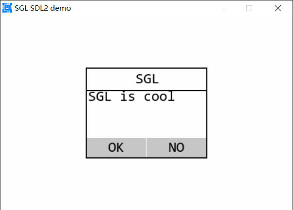
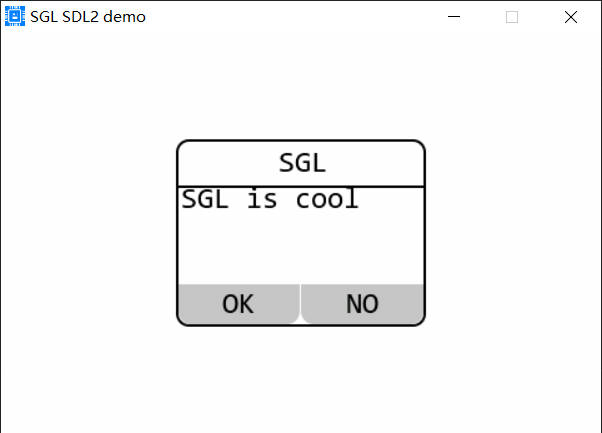
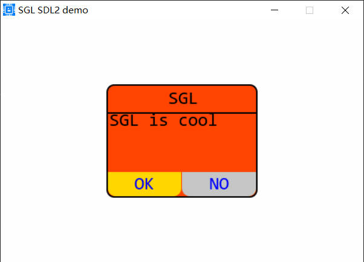
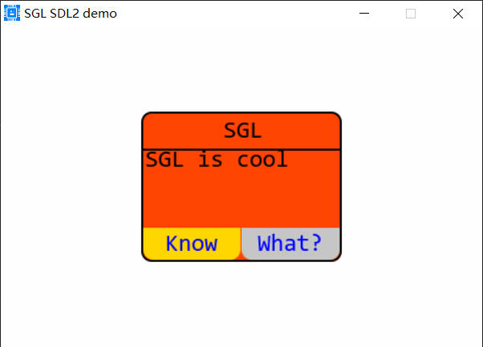

## msgbox控件
### 创建基本的msgbox控件
这个控件用于显示消息框，使用如下代码：
```c
sgl_obj_t *msgbox = sgl_msgbox_create(NULL);
sgl_obj_set_size(msgbox, 200, 150);
sgl_obj_set_pos_align(msgbox, SGL_ALIGN_CENTER);
sgl_msgbox_set_font(msgbox, &consolas24_compress);
```
上面的代码中sgl_obj_set_pos_align函数设置了消息框的位置，SGL_ALIGN_CENTER表示居中，sgl_msgbox_set_font函数设置消息框的字体，consolas24_compress表示Consolas字体，24号，压缩字体。效果如下：          
             

### 设置消息框的标题和内容
使用sgl_msgbox_set_title_text函数设置消息框的标题，使用sgl_msgbox_set_msg_text函数设置消息框的内容，如下： 
```c
sgl_obj_t *msgbox = sgl_msgbox_create(NULL);
sgl_obj_set_size(msgbox, 200, 150);
sgl_obj_set_pos_align(msgbox, SGL_ALIGN_CENTER);
sgl_msgbox_set_font(msgbox, &consolas24_compress);
sgl_msgbox_set_title_text(msgbox, "SGL");
sgl_msgbox_set_msg_text(msgbox, "SGL is cool");
```
效果如下:       
       

### 设置消息框的圆角半径
使用sgl_msgbox_set_radius函数设置消息框的圆角半径，如下：
```c
sgl_obj_t *msgbox = sgl_msgbox_create(NULL);
sgl_obj_set_size(msgbox, 200, 150);
sgl_obj_set_pos_align(msgbox, SGL_ALIGN_CENTER);
sgl_msgbox_set_font(msgbox, &consolas24_compress);
sgl_msgbox_set_title_text(msgbox, "SGL");
sgl_msgbox_set_msg_text(msgbox, "SGL is cool");
sgl_msgbox_set_radius(msgbox, 10);
```
上面使用sgl_msgbox_set_radius函数设置消息框的圆角半径为10，效果如下：     
           

### 设置消息框的颜色
使用sgl_msgbox_set_color函数设置消息框的颜色，使用sgl_msgbox_set_apply_color函数设置消息框的按钮颜色，使用sgl_msgbox_set_close_text_color函数设置消息框的关闭按钮颜色，如下：
```c
sgl_obj_t *msgbox = sgl_msgbox_create(NULL);
sgl_obj_set_size(msgbox, 200, 150);
sgl_obj_set_pos_align(msgbox, SGL_ALIGN_CENTER);
sgl_msgbox_set_font(msgbox, &consolas24_compress);
sgl_msgbox_set_title_text(msgbox, "SGL");
sgl_msgbox_set_msg_text(msgbox, "SGL is cool");
sgl_msgbox_set_radius(msgbox, 10);
sgl_msgbox_set_color(msgbox, SGL_COLOR_RED_ORANGE);
sgl_msgbox_set_apply_color(msgbox, SGL_COLOR_GOLD);
sgl_msgbox_set_close_text_color(msgbox, SGL_COLOR_BLUE);
```
效果如下：     
         

### 设置消息框的按钮文本
使用sgl_msgbox_set_apply_text函数设置消息框的按钮文本，使用sgl_msgbox_set_close_text函数设置消息框的关闭按钮文本，如下：
```c
sgl_obj_t *msgbox = sgl_msgbox_create(NULL);
sgl_obj_set_size(msgbox, 200, 150);
sgl_obj_set_pos_align(msgbox, SGL_ALIGN_CENTER);
sgl_msgbox_set_font(msgbox, &consolas24_compress);
sgl_msgbox_set_title_text(msgbox, "SGL");
sgl_msgbox_set_msg_text(msgbox, "SGL is cool");
sgl_msgbox_set_radius(msgbox, 10);
sgl_msgbox_set_color(msgbox, SGL_COLOR_RED_ORANGE);
sgl_msgbox_set_apply_color(msgbox, SGL_COLOR_GOLD);
sgl_msgbox_set_close_text_color(msgbox, SGL_COLOR_BLUE);
sgl_msgbox_set_apply_text(msgbox, "Know");
sgl_msgbox_set_close_text(msgbox, "What?");
```
效果如下：      
           

